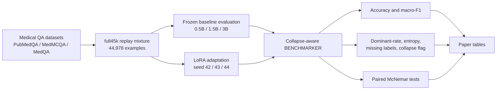
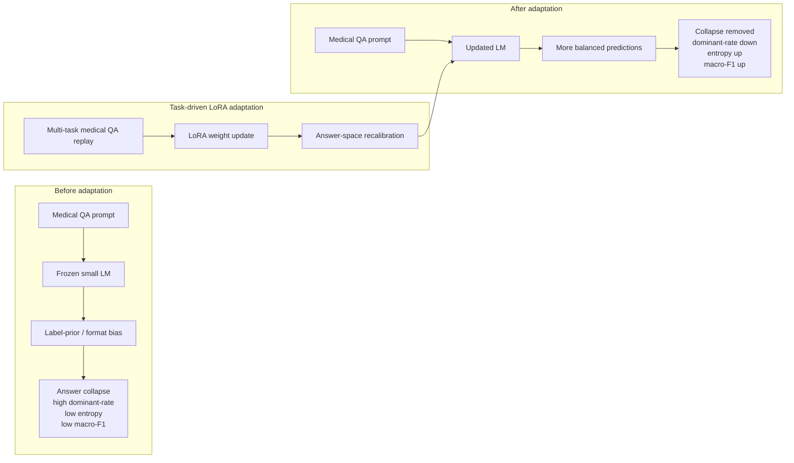

# Figure Drafts

## Figure 1. Experimental Pipeline

## Figure 2. Collapse Mitigation Mechanism

## Visual Emphasis for Final Artwork

- Figure 1 should be clean and pipeline-oriented: data, update, benchmarker, statistics, tables.
- Figure 2 should be mechanism-oriented: frozen bias, LoRA update, answer-space recalibration.
- Use three metric arrows in Figure 2: dominant-rate down, entropy up, macro-F1 up.
- Avoid implying autonomous self-training. Label the mechanism as task-driven LoRA adaptation.
